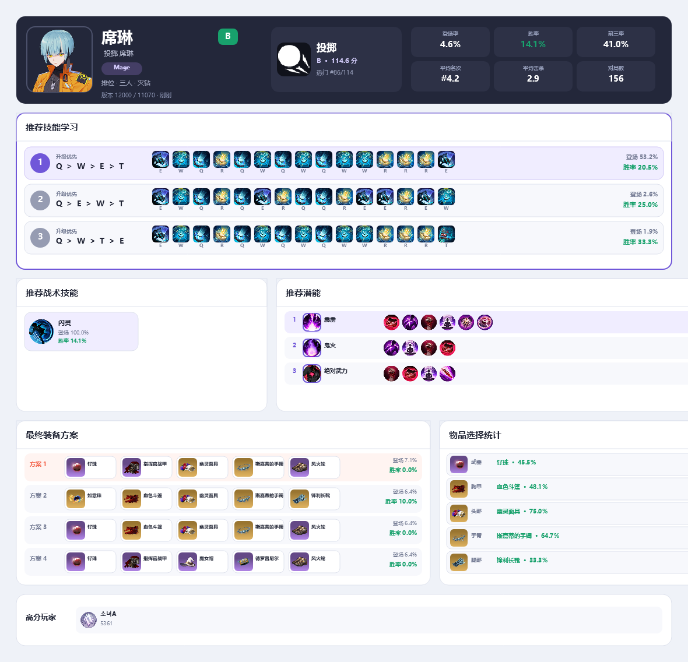
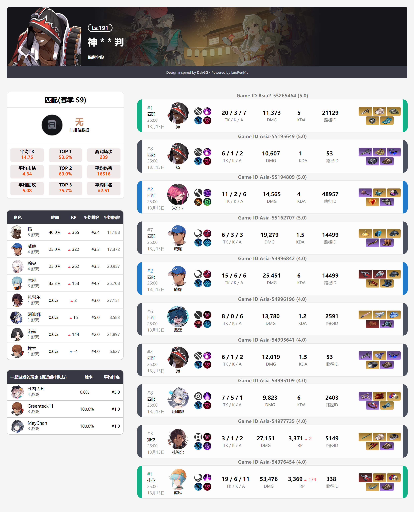
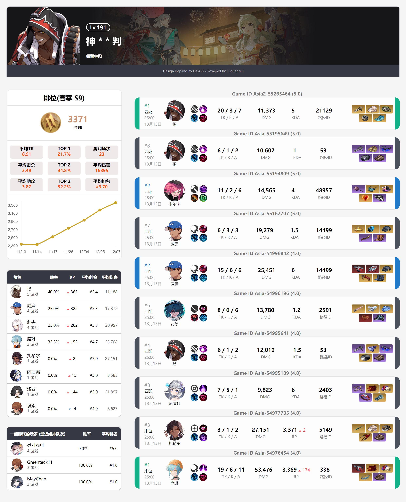
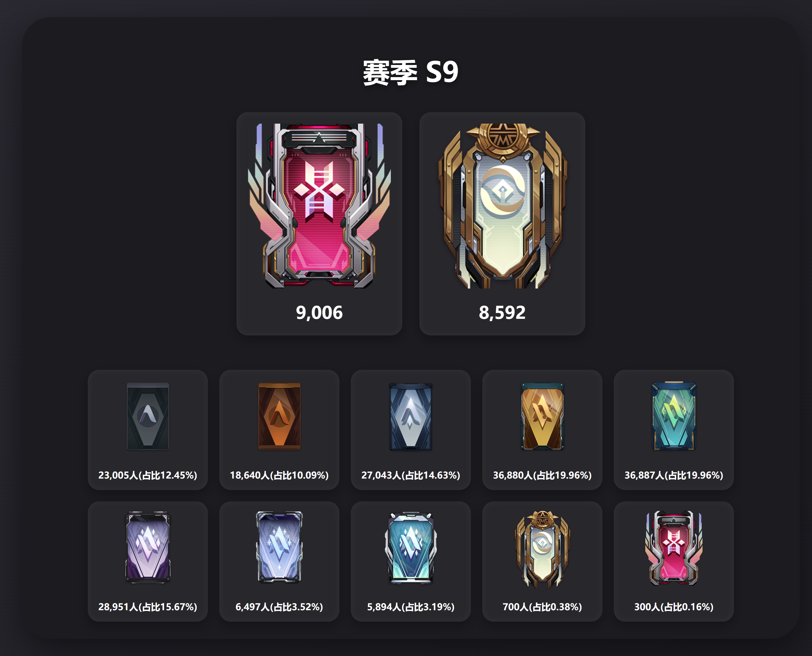

# EternalReturnLoMu

<div style="text-align: center">

</div>

永恒轮回战绩查询机器人，支持 QQ 官方机器人和 OneBot 11。项目提供玩家战绩、角色数据、段位统计、兑换码与查询统计等命令，并附带带令牌认证的 Web 管理后台。

## 命令效果

以下图片均由真实运行环境和实时接口数据生成，角色强度与统计数值会随版本更新发生变化。

### `/查询角色 席琳`

展示角色评级、武器流派、技能加点、出装、潜能与高分玩家。



### `/角色数据`

紧凑展示当前段位下全部角色及武器的评级、胜率和平均伤害。


### `/查询玩家 <玩家名称>`





### `/段位统计`



## OneBot 部署教程

### 1. 准备环境

- 安装 Java 17 或更高版本，并确认 `java -version` 可以正常执行。
- 准备兼容 OneBot 11 的 QQ 实现，例如 NapCatQQ。
- 从 GitHub Actions 下载并解压 `onebot-3.0.0.zip`；带 `v*` 标签的版本也会附加到对应 GitHub Release。也可以在项目根目录执行：

```powershell
.\gradlew.bat test stageDistributions
```

Linux/macOS 使用：

```bash
./gradlew test stageDistributions
```

本地构建结果位于 `build/distributions/onebot`。

### 2. 检查目录结构

将完整 OneBot 构建产物放在同一目录，不要只复制主程序 JAR：

```text
onebot/
├─ onebot-3.0.0.jar
└─ plugins/
   ├─ character-1.0.0.jar
   ├─ news-1.0.0.jar
   ├─ player-1.0.0.jar
   ├─ query-statistics-1.0.0.jar
   └─ tier-1.0.0.jar
```

`config.json`、SQLite 数据库、日志和渲染图片都会以主程序 JAR 所在目录为基准生成。

### 3. 首次启动

进入 JAR 所在目录后执行：

```bash
java -jar onebot-3.0.0.jar
```

首次启动会在 JAR 同级创建默认 `config.json`。此时 OneBot 地址尚未配置，机器人会跳过 QQ 连接，但管理后台仍会启动。编辑配置后重启程序即可。

OneBot 管理后台使用 `config.json` 的 `port` 字段，默认是 `8080`。也可以仅为本次启动临时覆盖：

```bash
java -jar onebot-3.0.0.jar --port=5752
```

如果端口被占用，程序会自动继续尝试后续端口，请以控制台打印的实际地址为准。

### 4. 配置 OneBot 11 服务

在 OneBot 实现中启用以下两个服务：

1. HTTP API 服务，用于机器人主动发送消息。
2. 正向 WebSocket 服务，用于机器人接收群消息事件。

例如将 HTTP API 监听在 `127.0.0.1:3000`，正向 WebSocket 监听在 `127.0.0.1:3001`。端口可以自行修改，但必须与 `config.json` 保持一致。

当前程序只从配置中读取 HTTP 与 WebSocket 地址；OneBot 端的 HTTP/WS Access Token 请保持为空。`adminToken` 是 Web 管理后台令牌，与 OneBot Access Token 无关。

### 5. 配置 `config.json`

下面是可直接修改的完整示例，请替换令牌、地址和数据库密码，不要把真实密钥提交到 Git：

```json
{
  "port": 8080,
  "adminToken": "change-this-admin-token",
  "apiKey": "",
  "other": {
    "one_bot_http": "http://127.0.0.1:3000",
    "one_bot_ws": "ws://127.0.0.1:3001"
  },
  "postgres": {
    "host": "127.0.0.1",
    "port": 5432,
    "database": "bot_db",
    "user": "postgres",
    "password": "change-this-password",
    "schema": "public"
  },
  "ai": {
    "apiKey": "",
    "model": "Qwen/Qwen3-VL-30B-A3B-Thinking",
    "baseUrl": "https://api.siliconflow.cn/v1"
  }
}
```

字段说明：

| 字段 | OneBot 部署说明 |
| --- | --- |
| `adminToken` | Web 管理后台登录令牌，不能为空，建议使用足够长的随机字符串。 |
| `apiKey` | 永恒轮回官方 Open API Key；不使用相关接口时可以留空。 |
| `other.one_bot_http` | OneBot 11 HTTP API 根地址，必须包含 `http://` 或 `https://`。 |
| `other.one_bot_ws` | OneBot 11 正向 WebSocket 地址，必须包含 `ws://` 或 `wss://`。 |
| `postgres` | QQ 官方机器人使用的 PostgreSQL 配置；OneBot 模式默认使用本地 SQLite，因此无需额外部署 PostgreSQL。 |
| `ai` | 可选 AI 服务配置；不使用 AI 功能时将 `apiKey` 留空。 |
| `port` | 服务端口；QQ 官方机器人和 OneBot 管理后台统一读取此字段，默认是 `8080`。 |

`other` 是一个键值对象。部署 OneBot 时请保留 `one_bot_http` 和 `one_bot_ws`；QQ 官方机器人使用的 `app_id`、`secret`、`token` 不需要填写。

### 6. 启动并验证

重启 OneBot 实现，再启动机器人：

```bash
java -jar onebot-3.0.0.jar
```

控制台出现 OneBot 连接成功、插件加载完成和管理后台地址后，访问：

```text
http://127.0.0.1:8080/
```

输入 `config.json` 中的 `adminToken` 登录。在管理后台可以查看运行状态、管理插件，并在 Debug 页面选择当前可用命令进行测试。

在 QQ 群中发送以下命令验证消息收发：

```text
/帮助
/查询角色 席琳
/角色数据
```

OneBot 不支持 QQ 官方机器人的 Markdown 消息元素，因此程序会自动转为保留换行的普通文本；图片命令不受影响。

### 7. 运行时文件

```text
onebot/
├─ config.json
├─ data/lomu.db
├─ logs/
├─ resources/render/
├─ plugins/
└─ onebot-3.0.0.jar
```

- `data/lomu.db`：OneBot 本地 SQLite 数据库。
- `resources/render`：命令生成的图片。
- `plugins`：命令插件及插件状态文件。
- `logs`：运行日志和错误日志。

更新版本前建议备份 `config.json`、`data` 和 `plugins/plugin-state.properties`。

### 常见问题

**启动后提示“OneBot 地址未配置”**

检查 `other.one_bot_http` 和 `other.one_bot_ws` 是否同时存在，修改后需要重启机器人。

**提示“请先启动 OneBot 服务”或连接失败**

确认 OneBot 实现已经登录 QQ，HTTP API 与正向 WebSocket 均已启用，并检查协议、IP、端口是否完全一致。

**群消息没有响应**

确认 OneBot 实现确实上报群消息事件、机器人 QQ 在目标群中，并先使用 `/帮助` 测试。再到管理后台检查插件是否启用以及异常日志。

**无法打开管理后台**

查看启动日志中的实际端口。远程部署时还需检查防火墙；不要将管理后台直接暴露到公网。

## 相关链接

- 仓库：<https://github.com/LuoRenMu/EternalReturnLoMu>
- QQ 群：`654087758`
- 原始项目：[onebot-lomu](https://github.com/LuoRenMu/onebot-lomu)
